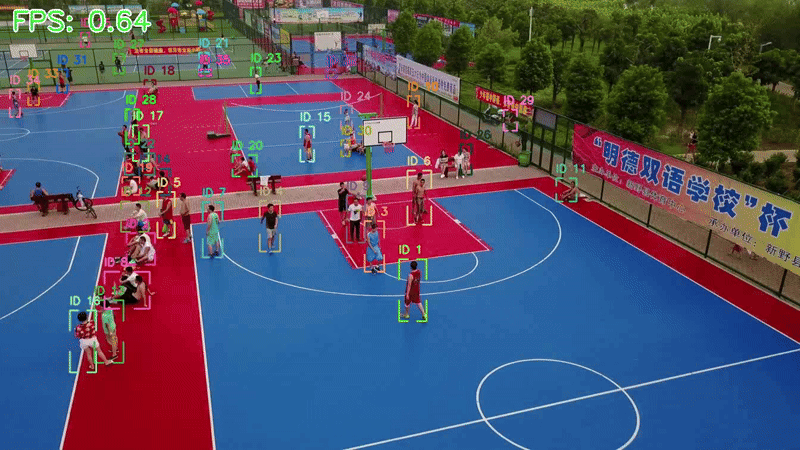
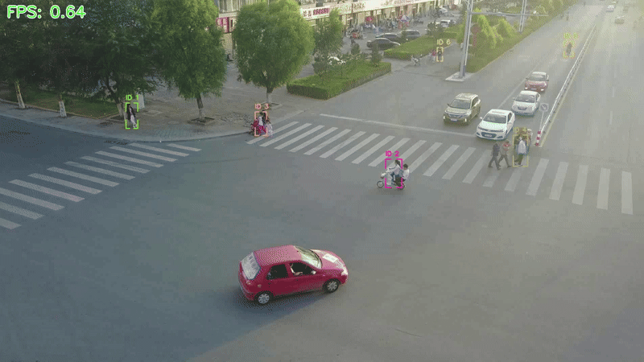
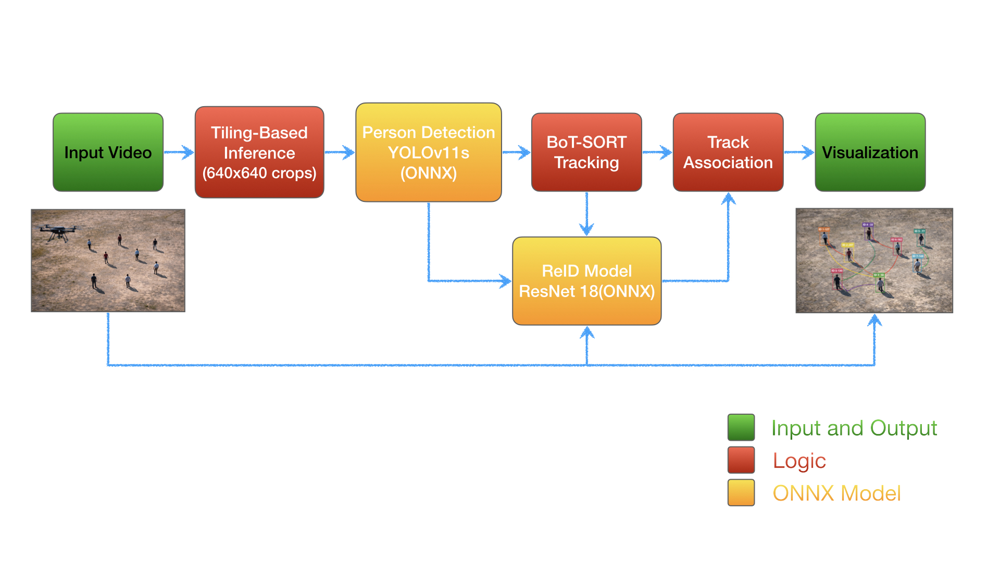

# 🚁 The Aerial Guardian: Motion-Aware Person Tracking for Drone Imagery

## 📌 Overview

This project presents a lightweight and efficient pipeline for **detecting and tracking persons in aerial imagery** captured from a moving drone platform.

The system is designed to address key challenges in drone-based computer vision:

- Small object sizes (persons appear very small at high altitude)
- Significant camera motion (drone ego-motion)
- Frequent occlusions and missed detections

---

## 🎥 Output Visualization

> Note: Outputs are stored in folders `D:\AerialTracker\aerial_track\outputs`






The output video includes:

- Bounding boxes with unique Track IDs  
- Distinct color per tracked object  
- Trajectory tail (last N positions)  
- Smooth and consistent tracking across frames  


## Block Diagram




## 🛠️ Installation

python version => 3.9

```bash
git clone https://github.com/Praveendhouchak94/AerialTracker
cd AerialTracker

python -m venv .venv
.venv\Scripts\activate
pip install -r requirements.txt

## ▶️ Run Inference

cd aerial_track

python main.py

options:
    -i, --input_video_path Path to the input video '<../test_videos/uav0000086_00000_v.mp4>'
    -d, --detection_model_path Path to the ONNX detection model '<model/detection_yolo11n.onnx>'
    -r, --reid_model_path Path to the ONNX ReID model '<model/reid_resnet18.onnx>'
    -o, --output_save_path Path to save the output video '<outputs>'
    -c, --device {cpu,cuda} to run the models on: 'cpu' or 'cuda' '<cpu>'

```

---

## 🔍 1. Person Detection Model

### Model Used:
- Trained **YOLOv11n** and **YOLOv11s**
- Selected **YOLOv11s** due to better accuracy, with a reasonable trade-off in speed  

### 💡 Why YOLOv11s?
- Fast inference  
- Relatively small model size  
- Better accuracy for small objects compared to YOLOv11n  

---

### 🔧 Key Modifications for Small Object Detection:
- Tiling-based inference (**640×640 crops**) to improve detection of small persons  
- Lowered confidence thresholds to increase recall  
- Applied **global NMS** across tiles to remove duplicate detections  

---

## 🔄 2. Tracking

### Tracker Used:
- **BoT-SORT (Ultralytics)**  

### Enhancements:
- Integrated a **custom ReID model (ResNet18 in ONNX format)**  
- Enabled appearance-based matching to reduce ID switching  
- Increased `track_buffer` to handle missed detections  

---

## 🔁 ID Switching Handling

To reduce ID switching caused by occlusions and camera motion:

- Combined:
  - IoU-based matching (BoT-SORT)  
  - Appearance-based matching (custom ReID model )  
- Increased `track_buffer` to preserve identities across missed frames  

---

## ⚡ Performance

| Metric    |   Value  |
|-----------|----------|
|    FPS    | ~ 1 FPS |
|  Hardware |   CPU    |

> Note: Performance is measured on CPU. FPS can be significantly improved using GPU or edge accelerators.

---

## 🧪 Edge Deployment (Jetson)

To deploy on edge devices like NVIDIA Jetson:

- Convert ONNX models → TensorRT for optimized inference  
- Use FP16 precision to improve speed and reduce memory usage  
- Apply **quantization** during ONNX → TensorRT conversion to further optimize performance  